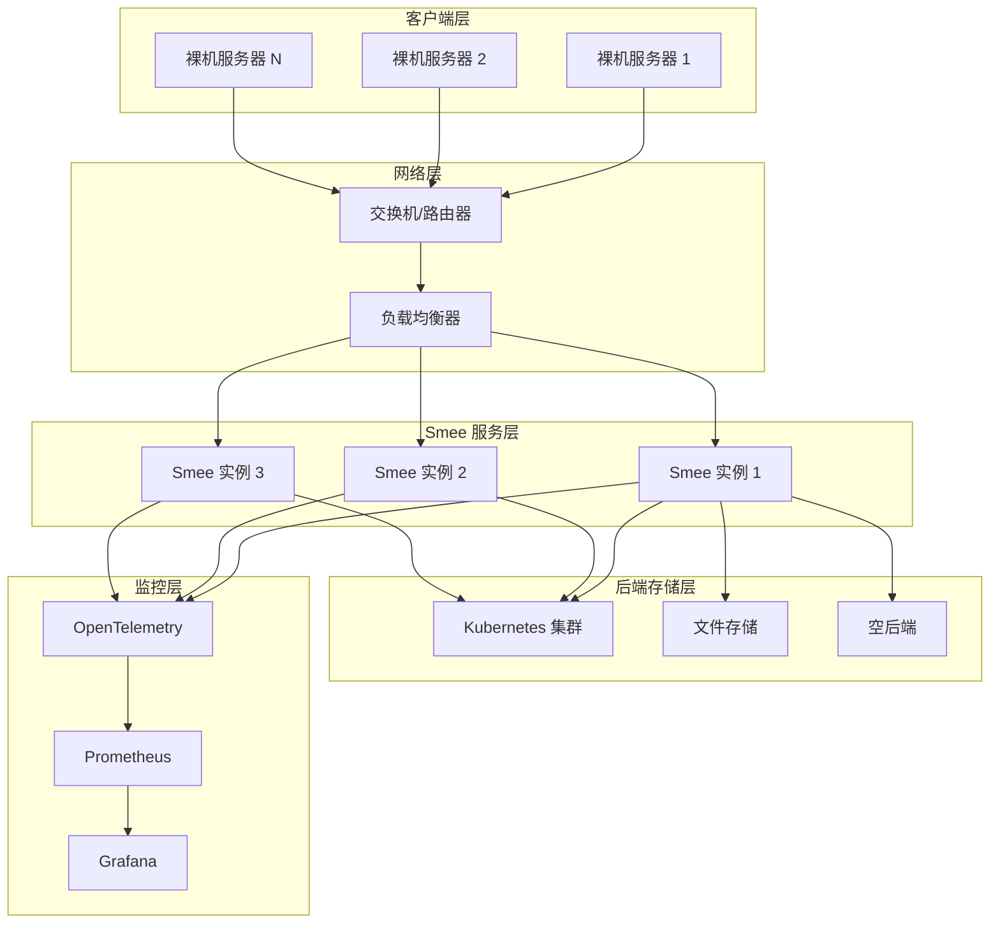
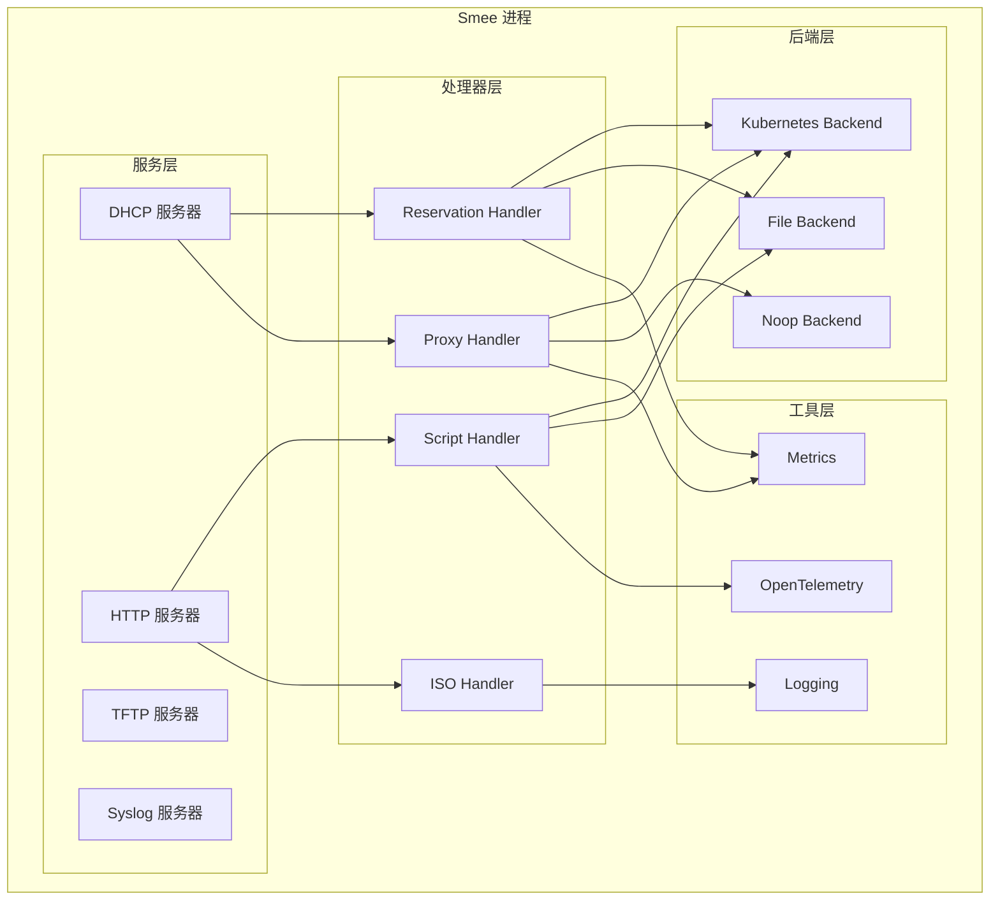
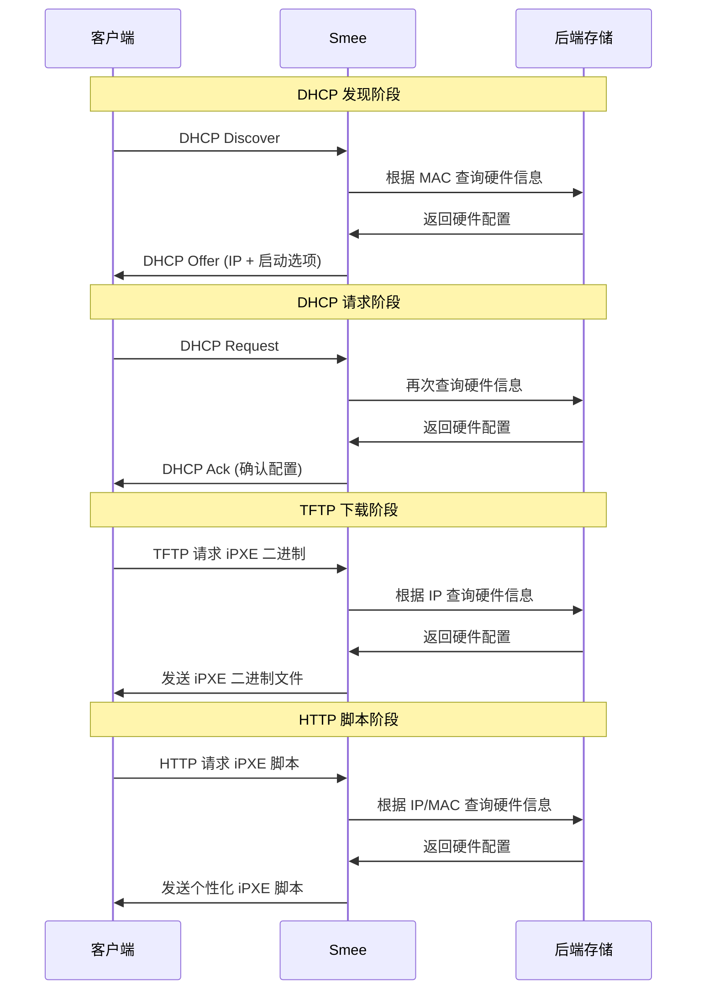
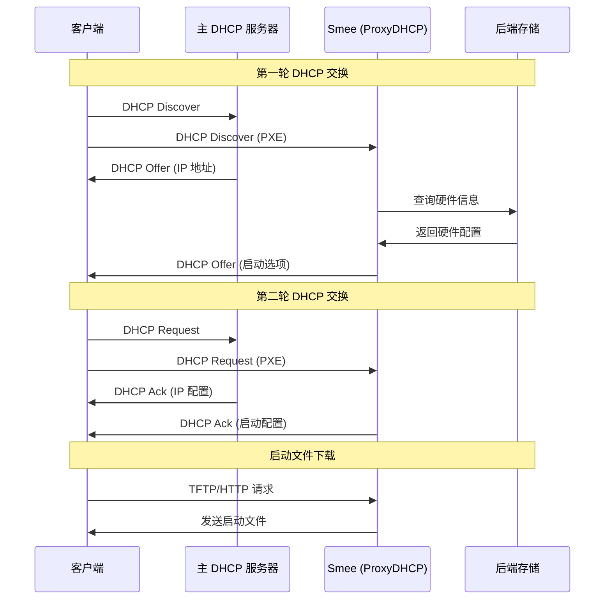
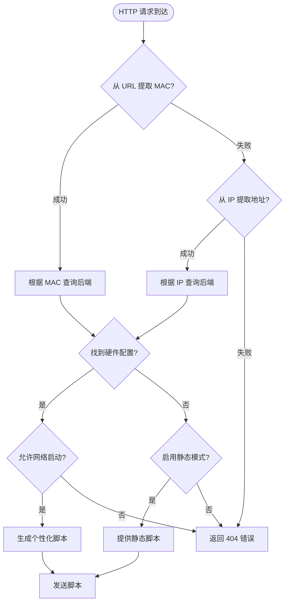
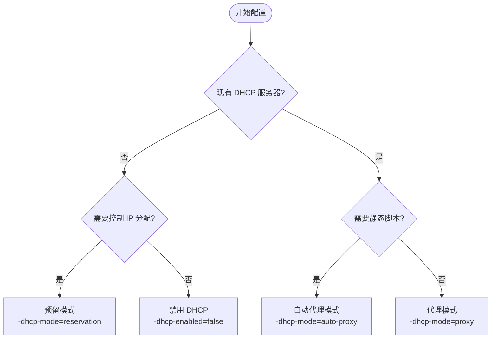
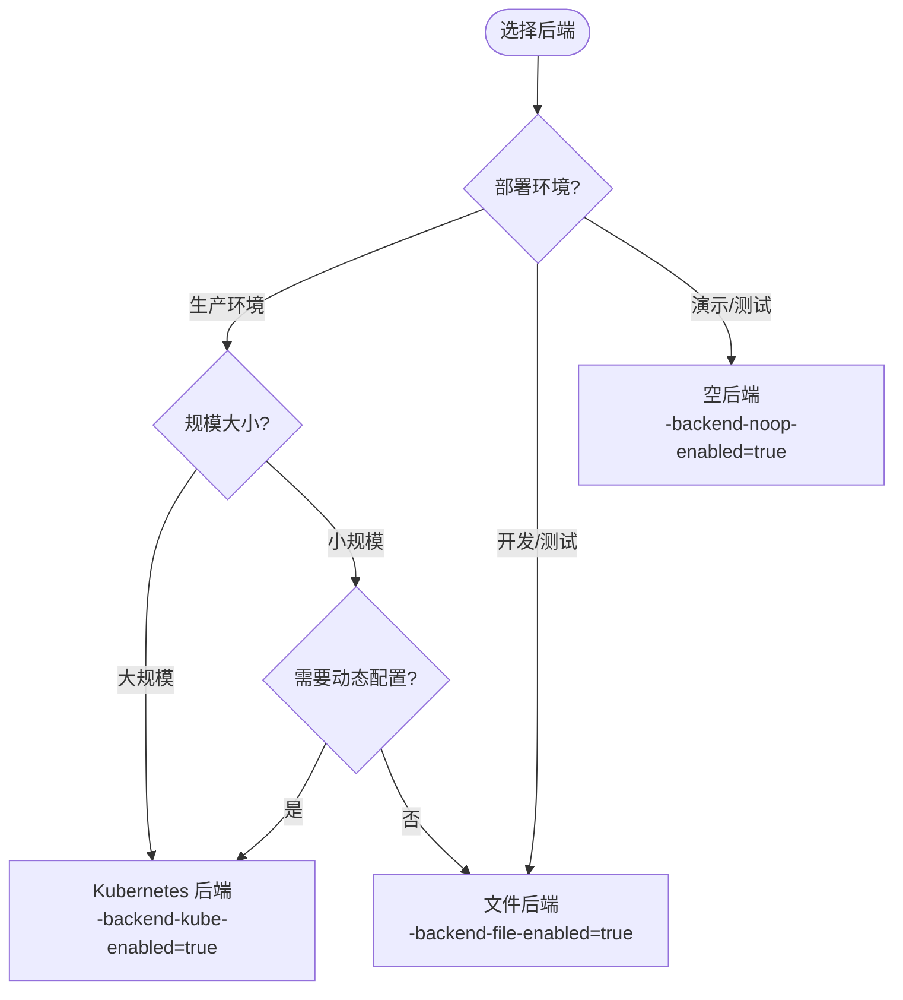
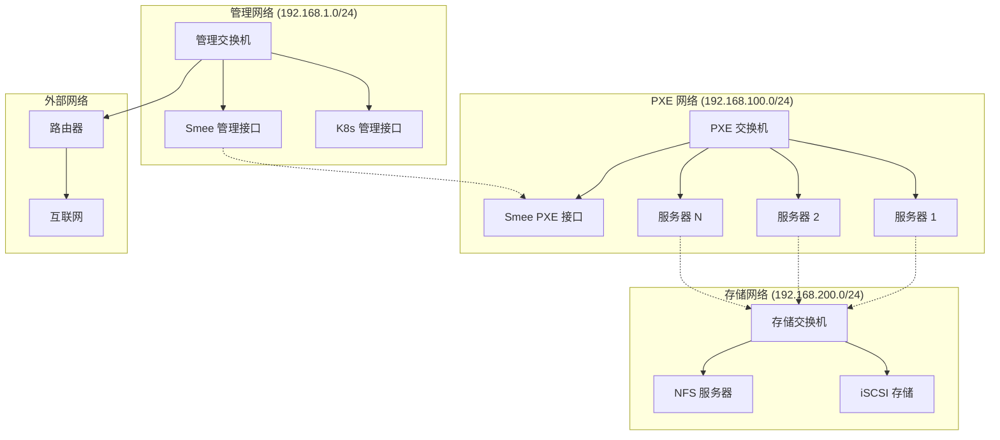
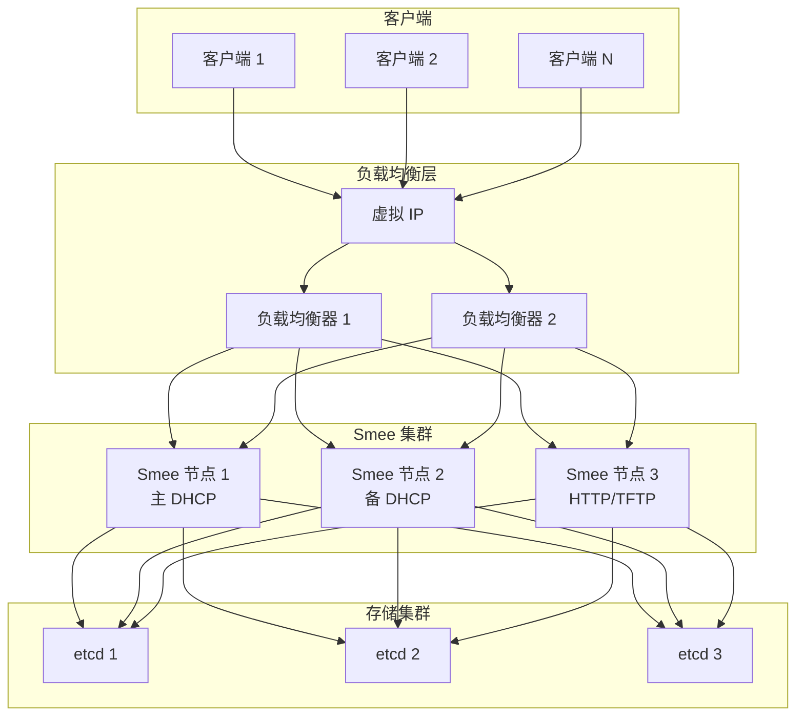
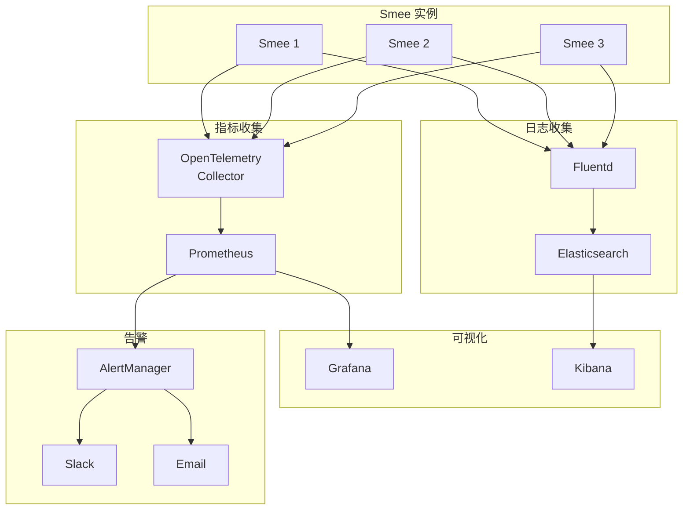

# Smee 架构图表和流程图

## 系统架构图

### 整体架构

### Smee 内部组件架构

## 数据流程图

### DHCP 预留模式流程

### DHCP 代理模式流程

### iPXE 脚本生成流程

## 配置决策树

### DHCP 模式选择

### 后端选择决策

## 网络拓扑图

### 典型部署拓扑

### 高可用部署拓扑

## 监控架构图

### 可观测性架构

这些图表提供了 Smee 系统的可视化表示，帮助理解其架构、数据流和部署模式。
